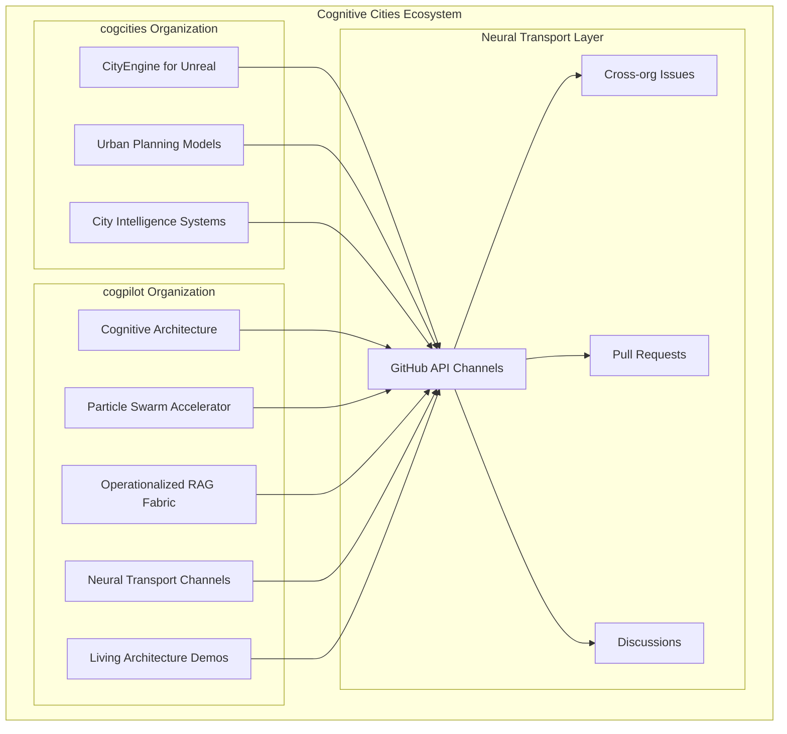

# 🏗️ Cognitive Cities Architecture Overview

## Executive Summary

This document outlines the distributed architecture for cognitive cities, extending the CityEngine for Unreal Engine foundation to support intelligent, self-evolving urban systems with inter-organizational coordination capabilities.

## Architecture Vision

## Core Principles

### 1. Fractal Organization Pattern
- **Self-similarity**: Each organizational unit (cogpilot, cogcities) maintains similar internal structure
- **Scalability**: Patterns work at repository, organization, and ecosystem levels
- **Emergent intelligence**: Higher-order behaviors emerge from simple interaction rules

### 2. Ordo Ab Chao (Order from Chaos)
- **Distributed coordination**: No central authority, emergent coordination through protocols
- **Adaptive governance**: Policies evolve based on system behavior and outcomes
- **Continuous learning**: System improves through feedback loops and accumulated experience

### 3. Living Architecture
- **Self-modification**: Systems can modify their own structure and behavior
- **Context preservation**: Maintains memory and learning across organizational boundaries
- **Progressive enhancement**: Capabilities expand through iterative improvement cycles

## System Components

### CityEngine Integration Layer
- **Procedural Building Generation**: Core UE5 plugin functionality preserved
- **Cognitive Enhancement**: AI-driven parameter optimization and pattern recognition
- **Real-time Adaptation**: Dynamic building generation based on cognitive city intelligence

### Distributed Intelligence Network
- **Neural Transport Protocols**: Communication channels between organizations
- **Context Propagation**: Shared understanding across system boundaries
- **Collective Memory**: Persistent knowledge accumulation and retrieval

### Inter-Organizational Coordination
- **cogpilot ↔ cogcities**: Bidirectional communication and collaboration
- **GitHub API Integration**: Leveraging existing infrastructure for coordination
- **Cross-boundary Learning**: Knowledge transfer and shared evolution

## Implementation Strategy

### Phase 1: Foundation (Current)
- [x] Repository structure establishment
- [x] Documentation framework creation
- [ ] Basic neural transport protocol implementation
- [ ] Inter-org communication channel setup

### Phase 2: Intelligence Integration
- [ ] Cognitive enhancement of CityEngine generation
- [ ] AI-driven urban planning optimization
- [ ] Real-time city intelligence systems

### Phase 3: Ecosystem Evolution
- [ ] Self-modifying architecture implementation
- [ ] Advanced inter-org coordination protocols
- [ ] Emergent behavior monitoring and guidance

## Success Metrics

### Technical Metrics
- **Communication Latency**: Time for information propagation between orgs
- **Context Preservation**: Accuracy of shared understanding maintenance
- **Adaptation Speed**: Time to implement system improvements

### Cognitive Metrics
- **Learning Velocity**: Rate of capability acquisition and improvement
- **Emergent Complexity**: Sophistication of system behaviors
- **Cross-boundary Intelligence**: Quality of inter-org collaborative outcomes

## Next Steps

1. **Establish neural transport channels** between cogpilot and cogcities organizations
2. **Implement basic cognitive enhancement** for CityEngine procedural generation
3. **Create demonstration scenarios** showing distributed intelligence capabilities
4. **Document emergent behaviors** and system evolution patterns

---

> **Note2Self (Copilot)**: This architecture document establishes the foundation for cognitive cities development. Key focus areas: maintain simplicity in implementation while enabling complex emergent behaviors. Priority on documentation-driven development to preserve context across sessions and organizational boundaries.