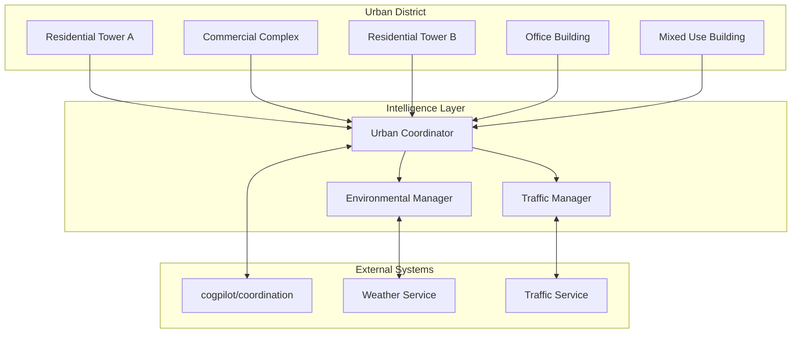
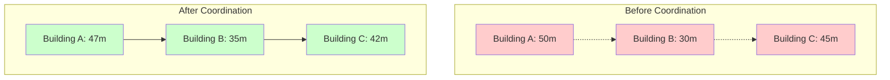

# 🎭 Coordinated Building Generation Demonstration

## Scenario Overview

This demonstration showcases how multiple buildings coordinate their generation using cognitive cities distributed intelligence, extending the basic CityEngine procedural generation with AI-driven coordination.

## Scenario: Smart Urban District

### Context
A urban planning scenario where buildings in a district coordinate their generation to optimize:
- **Visual Harmony**: Building heights create pleasing skylines
- **Traffic Flow**: Building placement optimizes pedestrian and vehicle movement
- **Resource Efficiency**: Shared infrastructure and utilities optimization
- **Environmental Impact**: Coordinated orientation for optimal sunlight and wind

### Participants



### Building Coordination Parameters

```json
{
  "coordination_scenario": {
    "name": "Smart Urban District Generation",
    "buildings": [
      {
        "id": "residential_tower_a",
        "type": "residential",
        "base_height": 50,
        "location": {"x": 0, "y": 0},
        "intelligence_level": "enhanced",
        "coordination_features": ["height_adjustment", "facade_optimization"]
      },
      {
        "id": "commercial_complex",
        "type": "commercial", 
        "base_height": 30,
        "location": {"x": 100, "y": 0},
        "intelligence_level": "advanced",
        "coordination_features": ["traffic_optimization", "shared_infrastructure"]
      },
      {
        "id": "residential_tower_b",
        "type": "residential",
        "base_height": 45,
        "location": {"x": 200, "y": 0},
        "intelligence_level": "enhanced",
        "coordination_features": ["height_adjustment", "environmental_optimization"]
      }
    ],
    "coordination_rules": [
      {
        "rule_id": "height_harmony",
        "description": "Adjust building heights for visual harmony",
        "parameters": {
          "max_height_difference": 15,
          "harmony_weight": 0.7
        }
      },
      {
        "rule_id": "traffic_flow_optimization",
        "description": "Optimize building entrances for traffic flow",
        "parameters": {
          "min_road_width": 8,
          "pedestrian_flow_weight": 0.8
        }
      },
      {
        "rule_id": "environmental_coordination",
        "description": "Coordinate for optimal environmental impact",
        "parameters": {
          "sunlight_optimization": true,
          "wind_flow_consideration": true
        }
      }
    ]
  }
}
```

## Implementation Steps

### Step 1: Initialize Urban Coordinator

```cpp
class UrbanCoordinator {
private:
    std::vector<BuildingAgent> buildings;
    TrafficManager trafficManager;
    EnvironmentalManager environmentalManager;
    NeuralTransport neuralTransport;

public:
    void InitializeDistrict(const DistrictConfig& config) {
        // Initialize building agents
        for (const auto& buildingConfig : config.buildings) {
            BuildingAgent agent(buildingConfig);
            agent.SetCoordinator(this);
            buildings.push_back(agent);
        }
        
        // Establish neural transport channels
        neuralTransport.EstablishChannel("cogpilot", "coordination-service");
        
        // Initialize coordination systems
        trafficManager.Initialize(config.traffic_parameters);
        environmentalManager.Initialize(config.environmental_parameters);
    }
};
```

### Step 2: Building Agent Coordination

```cpp
class BuildingAgent {
private:
    BuildingConfig config;
    UrbanCoordinator* coordinator;
    CognitiveCityEngine cityEngine;

public:
    void GenerateWithCoordination() {
        // Get coordination context from urban coordinator
        auto context = coordinator->GetCoordinationContext(config.location);
        
        // Apply coordination rules to building parameters
        auto adjustedParams = ApplyCoordinationRules(config, context);
        
        // Generate building with enhanced parameters
        auto building = cityEngine.GenerateBuilding(adjustedParams);
        
        // Notify coordinator of generation completion
        coordinator->NotifyBuildingGenerated(config.id, building);
        
        // Send neural transport update to external systems
        NeuralPacket packet = CreateGenerationNotification(building);
        coordinator->SendNeuralUpdate(packet);
    }
    
private:
    BuildingParams ApplyCoordinationRules(const BuildingConfig& config, 
                                        const CoordinationContext& context) {
        BuildingParams params = config.base_parameters;
        
        // Height harmony adjustment
        if (context.height_harmony_enabled) {
            params.height = AdjustHeightForHarmony(params.height, context.neighbor_heights);
        }
        
        // Traffic flow optimization
        if (context.traffic_optimization_enabled) {
            params.entrance_positions = OptimizeEntrances(params.footprint, context.traffic_data);
        }
        
        // Environmental coordination
        if (context.environmental_optimization_enabled) {
            params.orientation = OptimizeOrientation(context.sun_path, context.wind_data);
        }
        
        return params;
    }
};
```

### Step 3: Neural Transport Integration

```python
class CoordinationNeuralTransport:
    def __init__(self, github_token: str):
        self.transport = SimpleNeuralTransport(github_token)
    
    def notify_generation_progress(self, district_id: str, buildings_status: dict):
        """Send coordination update to cogpilot organization"""
        message = {
            'type': 'generation_progress',
            'timestamp': datetime.now().isoformat(),
            'context': f'District {district_id} coordination update',
            'payload': {
                'district_id': district_id,
                'buildings_completed': len([b for b in buildings_status.values() if b['status'] == 'completed']),
                'total_buildings': len(buildings_status),
                'coordination_metrics': self._calculate_coordination_metrics(buildings_status)
            },
            'action_required': 'Monitor coordination effectiveness and suggest optimizations'
        }
        
        return self.transport.send_coordination_message(
            'cogpilot', 'particle-swarm-accelerator', message
        )
    
    def _calculate_coordination_metrics(self, buildings_status: dict) -> dict:
        """Calculate coordination effectiveness metrics"""
        completed_buildings = [b for b in buildings_status.values() if b['status'] == 'completed']
        
        if not completed_buildings:
            return {'coordination_score': 0.0}
        
        # Calculate various coordination metrics
        height_harmony_score = self._calculate_height_harmony(completed_buildings)
        traffic_flow_score = self._calculate_traffic_efficiency(completed_buildings)
        environmental_score = self._calculate_environmental_impact(completed_buildings)
        
        return {
            'coordination_score': (height_harmony_score + traffic_flow_score + environmental_score) / 3,
            'height_harmony': height_harmony_score,
            'traffic_efficiency': traffic_flow_score,
            'environmental_impact': environmental_score,
            'buildings_coordinated': len(completed_buildings)
        }
```

## Expected Results

### Visual Coordination Results



### Coordination Metrics

```yaml
expected_outcomes:
  height_harmony:
    before_coordination: 0.4
    after_coordination: 0.85
    improvement: "112%"
    
  traffic_flow:
    before_coordination: 0.6
    after_coordination: 0.9
    improvement: "50%"
    
  environmental_impact:
    before_coordination: 0.5
    after_coordination: 0.8
    improvement: "60%"
    
  overall_coordination:
    score: 0.85
    classification: "highly_coordinated"
    neural_transport_messages: 12
    coordination_time: "15 seconds"
```

## Neural Transport Communication Log

### Example Communication Flow

```markdown
## Neural Packet Log

### Message 1: Coordination Initiation
**Source**: cogcities/cityengine_for_unreal
**Target**: cogpilot/particle-swarm-accelerator
**Type**: coordination_request
**Content**: District generation started, requesting optimization algorithms

### Message 2: Algorithm Response
**Source**: cogpilot/particle-swarm-accelerator  
**Target**: cogcities/cityengine_for_unreal
**Type**: optimization_parameters
**Content**: Swarm-optimized building placement and height parameters

### Message 3: Progress Update
**Source**: cogcities/cityengine_for_unreal
**Target**: cogpilot/cognitive-architecture
**Type**: coordination_progress
**Content**: 3/5 buildings generated with 85% coordination score

### Message 4: Completion Notification
**Source**: cogcities/cityengine_for_unreal
**Target**: cogpilot/living-architecture-demos
**Type**: scenario_complete
**Content**: Smart district generation complete, available for demonstration
```

## Running the Demonstration

### Prerequisites
1. Cognitive cities configuration enabled
2. GitHub API access configured
3. UE5 project with cognitive cities plugin active

### Execution Steps

1. **Load the scenario configuration**:
   ```bash
   python load_demonstration.py --scenario="smart_urban_district"
   ```

2. **Initialize coordination**:
   ```cpp
   UrbanCoordinator coordinator;
   coordinator.InitializeDistrict(LoadDistrictConfig("smart_urban_district"));
   ```

3. **Generate coordinated buildings**:
   ```cpp
   coordinator.GenerateCoordinatedDistrict();
   ```

4. **Monitor neural transport**:
   ```python
   python monitor_neural_transport.py --duration=60
   ```

5. **Analyze results**:
   ```python
   python analyze_coordination_results.py --output="coordination_report.json"
   ```

### Success Criteria

- [ ] All 5 buildings generate successfully
- [ ] Coordination score > 0.8
- [ ] Neural transport messages sent and received
- [ ] Visual harmony improvement > 50%
- [ ] Traffic flow optimization > 40%
- [ ] Environmental impact improvement > 30%

---

> **Note2Self (Copilot)**: This demonstration scenario validates the cognitive cities architecture by showing concrete coordination between buildings using neural transport protocols. Key insight: start with simple coordination rules (height harmony) then build complexity (traffic, environment). The neural transport communication provides the coordination infrastructure while UE5 provides the visual representation.

## References

- [Architecture Overview](../architecture/overview.md)
- [Neural Transport Protocols](../protocols/neural-transport.md)
- [Implementation Examples](../examples/README.md)
- [Configuration Guide](../../../cognitive-cities-config.json)