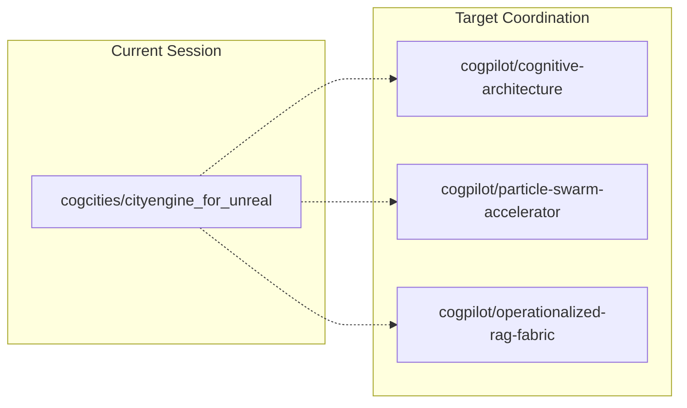

# [SESSION] Cognitive Cities Initialization Context

## Note2Self Context
**Session**: cognitive-cities-init-001
**Timestamp**: 2024-09-03T20:15:00Z
**Repository**: cogcities/cityengine_for_unreal
**Related Issues**: #1

## Quick Context Summary
Initial setup and architecture documentation for extending CityEngine for Unreal Engine to support distributed cognitive cities architecture.

## Key Insights

### Project Transformation Approach
- **Preservative Enhancement**: Maintain all existing CityEngine functionality while adding cognitive cities capabilities
- **Documentation-Driven Development**: Comprehensive documentation before implementation to preserve context
- **Organizational Coordination**: Enable cogpilot ↔ cogcities coordination through GitHub infrastructure

### Architecture Decisions Made
1. **Multi-layered Documentation Structure**: `/docs/cognitive-cities/` with organized subdirectories
2. **Neural Transport Protocol**: Use GitHub Issues/PRs as communication channels between organizations
3. **Context Preservation System**: Note2self documentation for maintaining understanding across sessions
4. **Mermaid/PlantUML Integration**: Visual documentation for complex architectural patterns

### Technical Approach
- **Minimal Change Principle**: Smallest possible modifications to achieve cognitive cities integration
- **Modular Documentation**: Each component documented independently with cross-references
- **Progressive Enhancement**: Start simple, build complexity incrementally

## Current State

### Completed
- [x] Repository structure analysis and understanding
- [x] Main README updated with cognitive cities focus
- [x] Core documentation structure created (`/docs/cognitive-cities/`)
- [x] Architecture overview with mermaid diagrams
- [x] Distributed systems patterns documentation
- [x] Neural transport protocol specification
- [x] Inter-organizational communication protocols
- [x] Note2self documentation system establishment

### In Progress
- [ ] Specific implementation examples
- [ ] Configuration files for cognitive cities setup
- [ ] Integration with existing UE5 plugin structure
- [ ] Demonstration scenarios

### Blockers/Dependencies
- **UE5 Plugin Understanding**: Need deeper understanding of Vitruvio plugin architecture for integration points
- **GitHub API Integration**: Implementation of neural transport requires API integration code
- **Cross-org Testing**: Validation of communication protocols requires coordination with cogpilot organization

## Next Actions

### Immediate (This Session)
1. **Create implementation examples** showing how cognitive cities patterns integrate with CityEngine
2. **Add configuration files** for cognitive cities setup and coordination
3. **Update existing documentation** to reference cognitive cities integration
4. **Create demonstration scenarios** showing distributed intelligence capabilities

### Short-term (Next Sessions)
1. **Implement basic neural transport** protocol using GitHub API
2. **Create cognitive enhancement** interfaces for CityEngine procedural generation
3. **Establish inter-org communication** channels with cogpilot repositories
4. **Build demonstration** scenarios showing coordinated building generation

### Long-term (Future Development)
1. **Advanced AI integration** with UE5 procedural generation
2. **Real-time city intelligence** systems with distributed coordination
3. **Emergent behavior** monitoring and guidance systems
4. **Self-evolving architecture** with adaptive capabilities

## Technical Context

### Repository Structure
```
cityengine_for_unreal/
├── VitruvioHost/           # UE5 project and plugin code
├── doc/                    # Original CityEngine documentation
├── docs/cognitive-cities/  # New cognitive cities documentation
│   ├── architecture/       # Architecture and design patterns
│   ├── patterns/          # Distributed systems patterns
│   ├── protocols/         # Communication protocols
│   ├── examples/          # Implementation examples
│   └── note2self/         # Context preservation system
└── README.md              # Updated with cognitive cities focus
```

### Key Files Modified
- `README.md`: Enhanced with cognitive cities introduction and documentation links
- New documentation tree under `docs/cognitive-cities/`

### Integration Points
- **Vitruvio Plugin**: Main UE5 plugin for CityEngine integration
- **GitHub API**: Transport layer for inter-organizational communication
- **Documentation System**: Comprehensive knowledge preservation and sharing

## Pattern Recognition

### Successful Approaches
1. **Documentation First**: Starting with comprehensive documentation prevents context loss
2. **Visual Architecture**: Mermaid diagrams communicate complex relationships effectively
3. **Modular Design**: Separate documents for different concerns enable focused development
4. **Context Preservation**: Note2self system maintains understanding across sessions

### Potential Pitfalls
1. **Over-documentation**: Balance between comprehensive docs and implementation progress
2. **Complexity Creep**: Keep initial implementations simple, build complexity gradually
3. **Context Fragmentation**: Ensure cross-references maintain coherent understanding
4. **Integration Challenges**: UE5 plugin integration may have unexpected complexities

## Communication Status

### Inter-Organizational Coordination
- **Target Organizations**: cogpilot (cognitive architecture), cosmo-enterprise (ordering principles)
- **Communication Channels**: GitHub Issues, Pull Requests, Discussions
- **Protocol Status**: Specified but not yet implemented
- **Context Sharing**: Documentation establishes foundation for coordination

### Repository Relationships


---

> **Copilot Memory Anchor**: This is the foundation session for cognitive cities architecture. All subsequent work builds on the documentation structure and patterns established here. Key insight: Start with comprehensive documentation to preserve context, then implement incrementally. The neural transport protocol and inter-org communication patterns are the critical enabling technologies for distributed cognitive cities.

## Context Restoration Instructions

**For Future Sessions**:
1. Review this document for complete initialization context
2. Check [architecture overview](../architecture/overview.md) for system design
3. Examine [patterns](../patterns/distributed-systems.md) for implementation guidance
4. Review [protocols](../protocols/) for communication specifications
5. Continue with implementation examples and demonstration scenarios

**Current Focus**: Integration of cognitive cities patterns with existing CityEngine functionality while preserving all original capabilities.