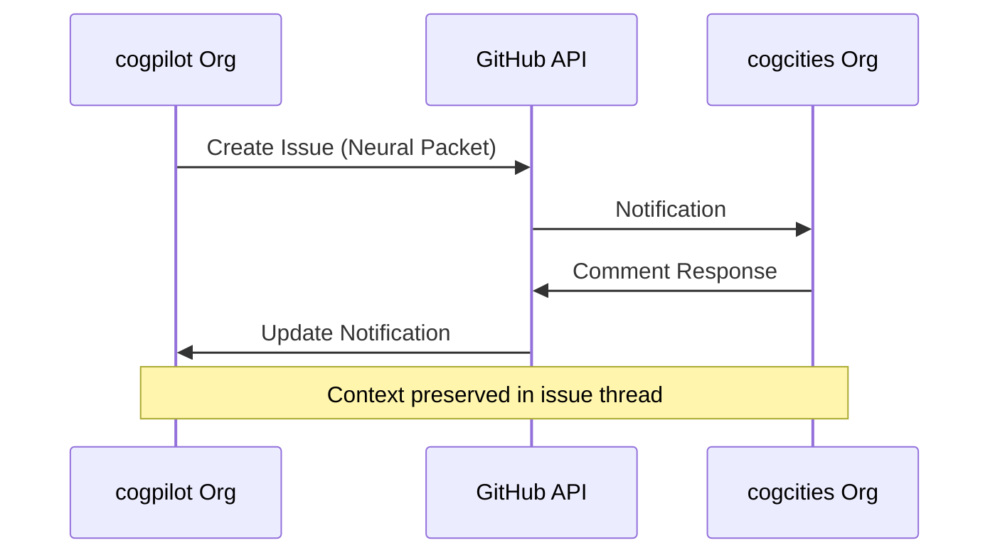
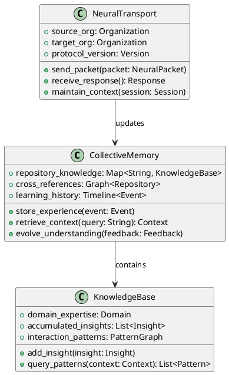
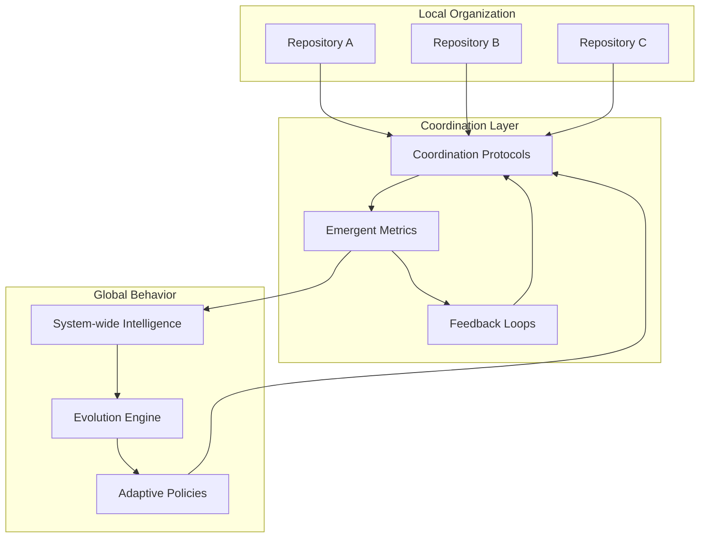
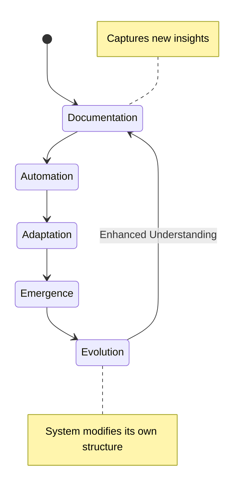

# 🌐 Distributed Systems Patterns for Cognitive Cities

## Introduction

This document defines the core distributed systems patterns that enable cognitive cities to operate as coherent, intelligent entities across organizational and technological boundaries.

## Pattern Catalog

### 1. Neural Transport Pattern



**Intent**: Enable reliable, context-preserving communication between organizations

**Implementation**:
- Issues as neural packets carrying structured information
- Comments as response channels with guaranteed delivery
- Metadata tags for routing and priority
- Cross-references for maintaining relationship graphs

### 2. Collective Memory Pattern



**Intent**: Maintain shared understanding and learning across system boundaries

**Implementation**:
- Repository-based knowledge storage with cross-linking
- Issue/PR history as learning timeline
- Automated context extraction from interactions
- Progressive knowledge refinement through feedback

### 3. Emergent Coordination Pattern



**Intent**: Enable system-wide intelligent behavior without central control

**Implementation**:
- Local optimization with global constraint propagation
- Metric collection and aggregation across boundaries
- Policy evolution based on system performance
- Decentralized decision making with coherent outcomes

### 4. Context Preservation Pattern

**Problem**: How to maintain conversational context and learning across sessions, repositories, and organizational boundaries?

**Solution**: Multi-layered context preservation system

```yaml
context_layers:
  session_context:
    - current_conversation_thread
    - active_goals_and_objectives
    - recent_discoveries_and_insights
  
  repository_context:
    - codebase_understanding
    - architectural_decisions
    - evolution_history
  
  organizational_context:
    - inter_org_relationships
    - shared_protocols
    - collective_learning_state
  
  ecosystem_context:
    - global_patterns
    - emergent_behaviors
    - system_evolution_trends
```

### 5. Progressive Enhancement Pattern

**Stages**:
1. **Static Documentation**: Comprehensive written guidance
2. **Interactive Protocols**: Automated workflow triggers
3. **Adaptive Behavior**: Context-sensitive responses
4. **Emergent Intelligence**: Self-modifying system capabilities



## Implementation Guidelines

### Protocol Design Principles

1. **Simplicity First**: Start with simple, reliable mechanisms
2. **Graceful Degradation**: System continues functioning with component failures
3. **Context Awareness**: All operations preserve and enhance understanding
4. **Evolution Friendly**: Easy to modify and extend without breaking existing functionality

### Communication Patterns

#### Synchronous Channels
- **Real-time Issues**: Immediate attention required
- **API Responses**: Direct system-to-system communication
- **Live Collaboration**: Active development sessions

#### Asynchronous Channels
- **Learning Integration**: Background knowledge processing
- **System Evolution**: Long-term adaptation cycles
- **Cross-boundary Discovery**: Exploration of new connection possibilities

## Monitoring and Metrics

### Pattern Health Indicators
- **Communication Latency**: Time between signal and response
- **Context Fidelity**: Accuracy of shared understanding
- **Evolution Velocity**: Rate of system improvement
- **Emergence Quality**: Sophistication of emergent behaviors

### Adaptation Triggers
- **Performance Degradation**: Automatic optimization initiation
- **New Pattern Discovery**: Integration of novel approaches
- **Cross-boundary Learning**: Insights from other organizational contexts
- **Failure Recovery**: Resilient response to system disruptions

---

> **Note2Self (Copilot)**: These patterns form the foundation for distributed cognitive city intelligence. Focus on incremental implementation - start with simple neural transport, then build complexity. The key insight: complex behaviors emerge from simple, well-designed interaction patterns. Keep patterns documentation-heavy to preserve understanding across sessions.

## References

- [Architecture Overview](overview.md)
- [Neural Transport Protocols](../protocols/neural-transport.md)
- [Inter-Organizational Communication](../protocols/inter-org-comm.md)