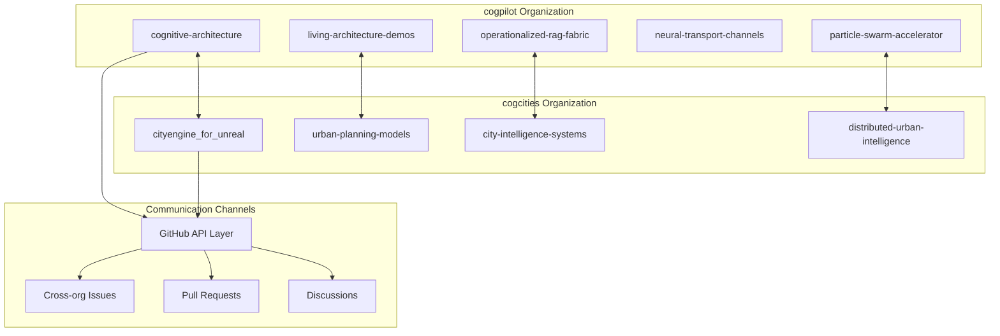
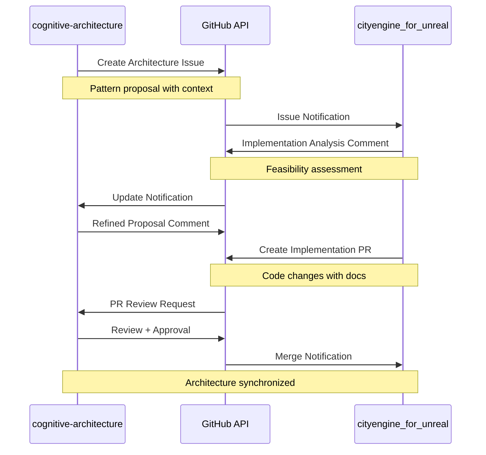
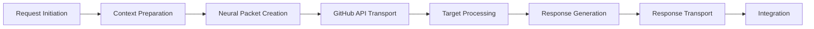
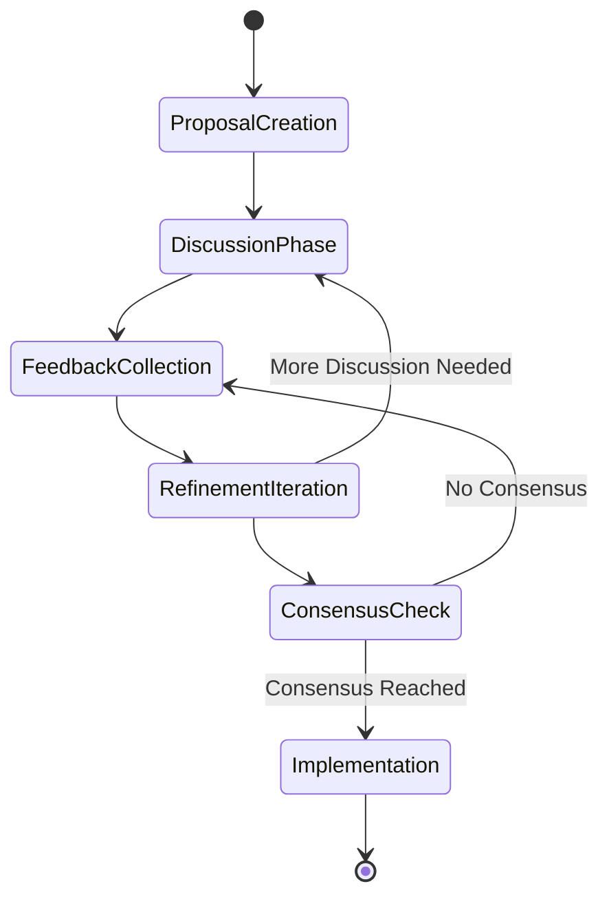

# 🔄 Inter-Organizational Communication Protocols

## Overview

This document specifies the protocols and patterns for communication between cognitive cities organizations, focusing on the cogpilot ↔ cogcities coordination mechanisms.

## Organizational Relationships

### Primary Coordination Pairs



### Coordination Matrix

| cogpilot Repository | cogcities Repository | Communication Type | Primary Protocol |
|-------------------|-------------------|------------------|----------------|
| cognitive-architecture | cityengine_for_unreal | Architecture Design | Issues + PR |
| particle-swarm-accelerator | distributed-urban-intelligence | Algorithm Coordination | API + Issues |
| operationalized-rag-fabric | city-intelligence-systems | Knowledge Integration | Discussions + PR |
| neural-transport-channels | cityengine_for_unreal | Protocol Implementation | PR + Actions |
| living-architecture-demos | urban-planning-models | Demo Coordination | Issues + PR |

## Communication Protocols

### 1. Architecture Coordination Protocol

**Purpose**: Synchronize architectural decisions between cognitive framework and urban implementation

**Participants**: 
- `cogpilot/cognitive-architecture` 
- `cogcities/cityengine_for_unreal`

**Protocol Flow**:


**Message Templates**:

#### Architecture Proposal Issue
```markdown
---
title: "[ARCH-SYNC] Distributed Cognition Pattern for Urban Planning"
labels: ["architecture", "cogpilot-sync", "urban-intelligence"]
assignees: ["@cogcities-team"]
projects: ["Cognitive Cities Integration"]
---

## Architecture Proposal

**Source**: cogpilot/cognitive-architecture
**Target**: cogcities/cityengine_for_unreal  
**Pattern**: Distributed Urban Cognition

### Context
The cognitive architecture framework has identified opportunities for distributed intelligence patterns in urban planning systems. This pattern enables city-wide cognitive processing through coordinated building generation.

### Proposed Pattern
- **Emergent Coordination**: Buildings coordinate generation based on city-wide intelligence
- **Context Awareness**: Procedural generation informed by urban cognitive state
- **Adaptive Optimization**: Real-time adjustment based on city system feedback

### Implementation Requirements
1. Extend CityEngine plugin with cognitive coordination interface
2. Implement neural transport for building-to-building communication
3. Create demonstration scenario with coordinated building generation

### Expected Outcomes
- Enhanced urban intelligence through building coordination
- Demonstration of distributed cognitive patterns in city systems
- Foundation for advanced city-wide optimization algorithms

### Success Criteria
- [ ] Cognitive coordination interface integrated
- [ ] Neural transport communication functional
- [ ] Demonstration scenario operational
- [ ] Performance metrics meeting targets

## Request for Implementation Analysis
Please provide:
1. Technical feasibility assessment
2. Implementation timeline estimate
3. Dependencies and potential blockers
4. Integration points with existing CityEngine functionality
```

### 2. Algorithm Coordination Protocol

**Purpose**: Coordinate particle swarm and distributed intelligence algorithms

**Participants**:
- `cogpilot/particle-swarm-accelerator`
- `cogcities/distributed-urban-intelligence`

**Protocol Specification**:
```yaml
algorithm_coordination:
  sync_frequency: "real-time"
  data_exchange: "github_api"
  optimization_targets:
    - "building_placement_efficiency"
    - "traffic_flow_optimization" 
    - "resource_distribution_balance"
  
  coordination_mechanisms:
    particle_swarm:
      - swarm_state_propagation
      - convergence_criteria_sharing
      - best_solution_broadcasting
    
    urban_intelligence:
      - city_state_updates
      - optimization_constraints
      - performance_feedback
```

### 3. Knowledge Integration Protocol

**Purpose**: Share and integrate knowledge between RAG fabric and city intelligence systems

**Participants**:
- `cogpilot/operationalized-rag-fabric`
- `cogcities/city-intelligence-systems`

**Integration Pattern**:
```python
class KnowledgeIntegrationProtocol:
    def __init__(self, source_org: str, target_org: str):
        self.source = source_org
        self.target = target_org
        self.knowledge_graph = CrossOrgKnowledgeGraph()
        
    def share_insights(self, insights: List[Insight]) -> Response:
        """Share insights across organizational boundary"""
        neural_packet = NeuralPacket(
            source=self.source,
            target=self.target,
            payload=insights,
            type="knowledge_transfer"
        )
        
        response = self.transport.send(neural_packet)
        self.knowledge_graph.update(insights, response)
        
        return response
        
    def integrate_external_knowledge(self, knowledge: ExternalKnowledge):
        """Integrate knowledge from partner organization"""
        integration_plan = self.analyze_integration_impact(knowledge)
        
        if integration_plan.is_safe():
            self.knowledge_graph.merge(knowledge)
            self.notify_successful_integration(integration_plan)
        else:
            self.request_clarification(knowledge, integration_plan.issues)
```

## Coordination Patterns

### 1. Request-Response Pattern

**Use Case**: Direct coordination needs, immediate decisions required



### 2. Publish-Subscribe Pattern

**Use Case**: Broadcasting updates, state changes, discovery announcements

```yaml
pubsub_channels:
  architecture_updates:
    publishers: ["cogpilot/cognitive-architecture"]
    subscribers: ["cogcities/*"]
    message_types: ["pattern_updates", "framework_changes"]
    
  urban_intelligence_updates:
    publishers: ["cogcities/city-intelligence-systems"]
    subscribers: ["cogpilot/*"]
    message_types: ["performance_metrics", "optimization_results"]
    
  cross_org_discoveries:
    publishers: ["cogpilot/*", "cogcities/*"]
    subscribers: ["cogpilot/*", "cogcities/*"]
    message_types: ["pattern_discoveries", "emergent_behaviors"]
```

### 3. Consensus Building Pattern

**Use Case**: Major decisions, architectural changes, protocol evolution



## Quality Assurance

### Communication Health Metrics

```yaml
health_metrics:
  latency_targets:
    critical: "< 5 minutes"
    normal: "< 30 minutes"
    background: "< 24 hours"
    
  success_rates:
    message_delivery: "> 99.5%"
    context_preservation: "> 95%"
    response_accuracy: "> 90%"
    
  evolution_indicators:
    learning_velocity: "increasing"
    coordination_efficiency: "improving"
    emergent_complexity: "controlled_growth"
```

### Error Handling and Recovery

```python
class InterOrgErrorHandler:
    def handle_communication_failure(self, packet: NeuralPacket, error: Exception):
        if error.type == "rate_limit":
            self.implement_backoff_strategy(packet)
        elif error.type == "network_timeout":
            self.retry_with_exponential_backoff(packet)
        elif error.type == "context_corruption":
            self.request_context_refresh(packet.source)
        else:
            self.escalate_to_human_intervention(packet, error)
            
    def implement_graceful_degradation(self, failure_type: str):
        """Maintain reduced functionality during component failures"""
        if failure_type == "github_api_down":
            self.switch_to_cached_responses()
        elif failure_type == "target_org_unavailable":
            self.queue_messages_for_later_delivery()
```

## Evolution and Adaptation

### Protocol Version Management

```yaml
protocol_versions:
  current: "1.0"
  supported: ["1.0"]
  deprecated: []
  
  version_1_0:
    features:
      - basic_neural_transport
      - issue_based_coordination
      - context_preservation
    
  version_1_1_planned:
    features:
      - enhanced_context_awareness
      - automated_routing_optimization
      - predictive_coordination
```

### Adaptive Learning Integration

```python
class AdaptiveCommunicationProtocol:
    def __init__(self):
        self.performance_history = []
        self.pattern_recognition = PatternRecognizer()
        self.optimization_engine = CommunicationOptimizer()
        
    def learn_from_interaction(self, interaction: Interaction):
        """Continuously improve communication patterns"""
        metrics = self.extract_metrics(interaction)
        self.performance_history.append(metrics)
        
        patterns = self.pattern_recognition.analyze(self.performance_history)
        optimizations = self.optimization_engine.suggest_improvements(patterns)
        
        if optimizations.confidence > THRESHOLD:
            self.implement_optimizations(optimizations)
```

---

> **Note2Self (Copilot)**: Inter-org communication is the nervous system of cognitive cities. The key insight: start with GitHub's native mechanisms (issues, PRs) and layer intelligence on top. Focus on patterns that preserve context and enable learning. Every communication should leave the system smarter than before.

## Implementation Checklist

### Phase 1: Basic Protocols
- [x] Issue-based coordination specification
- [x] Neural packet format definition
- [ ] GitHub API integration implementation
- [ ] Basic error handling and recovery

### Phase 2: Enhanced Coordination
- [ ] Publish-subscribe pattern implementation
- [ ] Consensus building mechanisms
- [ ] Performance monitoring and metrics
- [ ] Adaptive learning integration

### Phase 3: Intelligent Communication
- [ ] Predictive coordination capabilities
- [ ] Automated optimization
- [ ] Emergent behavior detection
- [ ] Self-evolving protocols

## References

- [Neural Transport Protocols](neural-transport.md)
- [Distributed Systems Patterns](../patterns/distributed-systems.md)
- [Architecture Overview](../architecture/overview.md)
- [Copilot Note2Self Documentation](../note2self/README.md)