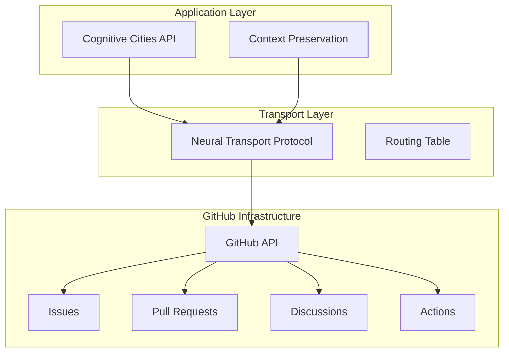

# 🧠 Neural Transport Protocols

## Protocol Overview

Neural Transport Protocols enable seamless communication and context sharing between cognitive cities organizations (cogpilot ↔ cogcities) using GitHub's infrastructure as the transport layer.

## Core Protocol Specification

### Protocol Stack



### Message Format Specification

#### Neural Packet Structure
```json
{
  "neural_packet": {
    "version": "1.0",
    "timestamp": "2024-09-03T20:15:00Z",
    "source": {
      "org": "cogpilot",
      "repo": "cognitive-architecture",
      "context": "session_id_12345"
    },
    "target": {
      "org": "cogcities", 
      "repo": "cityengine_for_unreal",
      "routing": "architecture_enhancement"
    },
    "payload": {
      "type": "knowledge_transfer",
      "content": {
        "insights": ["distributed_cognition_pattern"],
        "context": "Previous discussion on neural networks",
        "action_required": "integrate_pattern_into_cityengine"
      }
    },
    "metadata": {
      "priority": "normal",
      "persistence": "permanent",
      "evolution_stage": "implementation"
    }
  }
}
```

#### Response Packet Structure
```json
{
  "response_packet": {
    "version": "1.0",
    "timestamp": "2024-09-03T20:16:30Z",
    "reference": "neural_packet_id_67890",
    "source": {
      "org": "cogcities",
      "repo": "cityengine_for_unreal",
      "processor": "cognitive_enhancement_engine"
    },
    "status": {
      "code": "accepted",
      "message": "Pattern integration initiated",
      "confidence": 0.85
    },
    "feedback": {
      "implementation_plan": "doc_update_then_code_integration",
      "estimated_completion": "2024-09-03T21:00:00Z",
      "dependencies": ["mermaid_diagram_update"]
    }
  }
}
```

## Transport Mechanisms

### 1. Issue-Based Transport

**Use Case**: Long-term coordination, architectural decisions, knowledge transfer

**Implementation**:
```yaml
transport_config:
  channel_type: "github_issues"
  routing_labels:
    - "neural-transport"
    - "cogpilot-cogcities" 
    - "architecture"
  context_preservation:
    - issue_description: "Full context dump"
    - comments: "Conversation thread"
    - labels: "Categorical routing"
    - milestones: "Progress tracking"
```

**Example Issue Template**:
```markdown
---
title: "[NEURAL-TRANSPORT] Architecture Pattern Integration"
labels: ["neural-transport", "cogpilot-cogcities", "architecture"]
assignees: ["@copilot-system"]
---

## Neural Packet
**Source**: cogpilot/cognitive-architecture
**Target**: cogcities/cityengine_for_unreal
**Type**: knowledge_transfer

## Context
Previous architectural discussions identified need for distributed cognition patterns in urban planning systems.

## Payload
- **Pattern**: Emergent Coordination for City Intelligence
- **Implementation**: Extend CityEngine procedural generation with AI-driven optimization
- **Timeline**: Current sprint

## Action Required
1. Integrate pattern documentation into cognitive-cities docs
2. Implement basic coordination interface in CityEngine plugin
3. Create demonstration scenario

## Response Expected
- Implementation plan with timeline
- Dependencies and blockers identification
- Feedback on pattern suitability for urban planning context
```

### 2. Pull Request Transport

**Use Case**: Code changes, documentation updates, implementation collaboration

**Implementation**:
```yaml
pr_transport:
  cross_org_collaboration: true
  context_headers:
    - "X-Neural-Source": "cogpilot/repo"
    - "X-Neural-Target": "cogcities/repo"
    - "X-Context-ID": "session_id"
  commit_message_format:
    - "[NEURAL] Description of change"
    - "Source-Context: detailed_background"
    - "Integration-Impact: expected_outcomes"
```

### 3. Discussions Transport

**Use Case**: Brainstorming, pattern exploration, emergent behavior analysis

**Implementation**:
```yaml
discussions_transport:
  categories:
    - "Neural Architecture"
    - "Pattern Discovery"
    - "System Evolution"
  polling_enabled: true
  context_threading: true
```

## Context Preservation Mechanisms

### Session Context Management

```python
class SessionContextManager:
    def __init__(self, session_id: str):
        self.session_id = session_id
        self.context_stack = []
        self.cross_references = {}
        
    def push_context(self, context: Dict):
        """Add context layer to current session"""
        self.context_stack.append({
            'timestamp': datetime.now(),
            'context': context,
            'source': self._get_current_source()
        })
        
    def get_full_context(self) -> Dict:
        """Retrieve complete session context"""
        return {
            'session_id': self.session_id,
            'timeline': self.context_stack,
            'cross_references': self.cross_references,
            'current_state': self._summarize_current_state()
        }
        
    def propagate_context(self, target_org: str, target_repo: str):
        """Send context to target organization"""
        neural_packet = self._create_neural_packet(
            target_org, target_repo, self.get_full_context()
        )
        self._send_via_github_api(neural_packet)
```

### Cross-Repository Context Linking

```yaml
context_links:
  repository_mapping:
    "cogpilot/cognitive-architecture": 
      - "cogcities/cityengine_for_unreal"
      - "cosmo-enterprise/ordering-principles"
    "cogcities/cityengine_for_unreal":
      - "cogpilot/cognitive-architecture"
      - "cogpilot/living-architecture-demos"
      
  link_types:
    - "knowledge_dependency"
    - "implementation_coordination" 
    - "pattern_sharing"
    - "evolution_tracking"
```

## Quality of Service (QoS) Parameters

### Priority Levels
- **Critical**: System stability, security issues
- **High**: Active development coordination
- **Normal**: Knowledge transfer, pattern sharing
- **Low**: Background learning, exploration

### Reliability Guarantees
- **At-least-once**: All neural packets delivered
- **Ordering**: Conversation threads maintain chronological order
- **Durability**: Context preserved indefinitely in GitHub history
- **Availability**: 99.9% uptime leveraging GitHub infrastructure

### Performance Metrics
- **Latency**: Target <2 minutes for normal priority
- **Throughput**: Support for concurrent multi-org conversations
- **Context Fidelity**: >95% accuracy in context preservation
- **Evolution Tracking**: Complete audit trail of system changes

## Implementation Roadmap

### Phase 1: Basic Transport (Current)
- [x] Issue-based neural packet specification
- [x] Context preservation format design
- [ ] Basic GitHub API integration
- [ ] Simple routing implementation

### Phase 2: Enhanced Coordination
- [ ] PR-based code collaboration
- [ ] Automated context propagation
- [ ] Quality of service implementation
- [ ] Performance monitoring

### Phase 3: Intelligent Transport
- [ ] AI-driven routing optimization
- [ ] Predictive context preparation
- [ ] Adaptive protocol evolution
- [ ] Emergent behavior detection

## Security and Privacy

### Data Protection
- All communication through public GitHub repositories
- No sensitive information in neural packets
- Context anonymization where required
- Audit trail preservation

### Access Control
- Organization-level permissions
- Repository-specific routing rules
- API rate limiting compliance
- Graceful degradation on access failures

---

> **Note2Self (Copilot)**: The neural transport protocol is the foundation for all inter-org communication. Start simple with issues, then build complexity. Key insight: GitHub's existing infrastructure provides reliability and persistence - leverage it fully. Focus on context preservation - this is what makes the system truly intelligent over time.

## References

- [Distributed Systems Patterns](../patterns/distributed-systems.md)
- [Inter-Organizational Communication](inter-org-comm.md)
- [Architecture Overview](../architecture/overview.md)